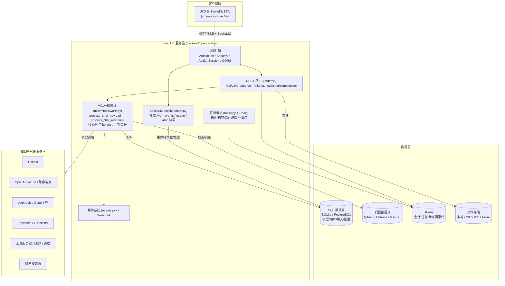
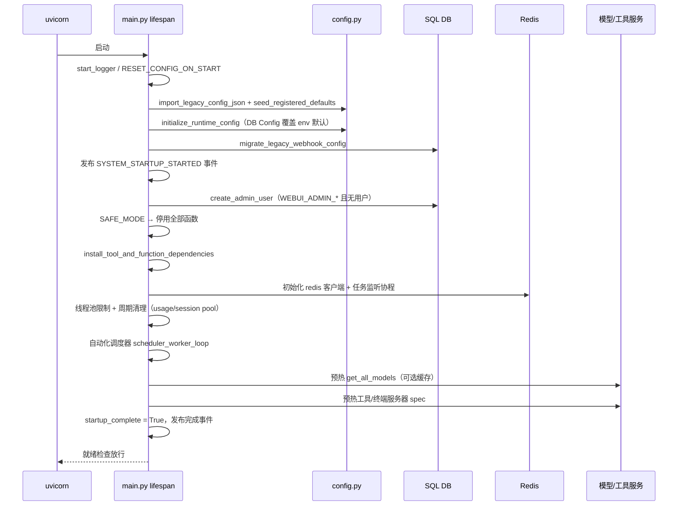
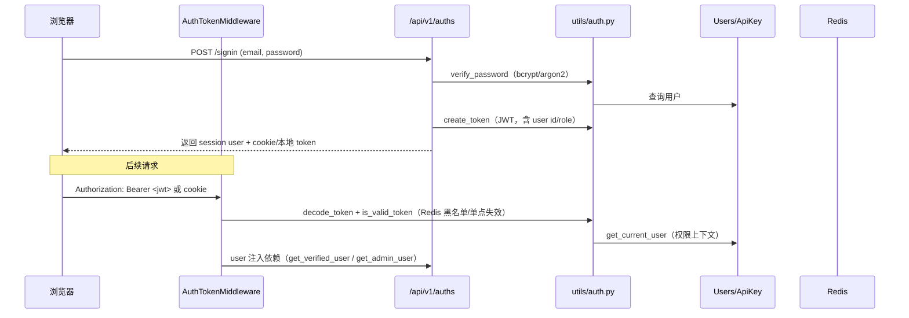
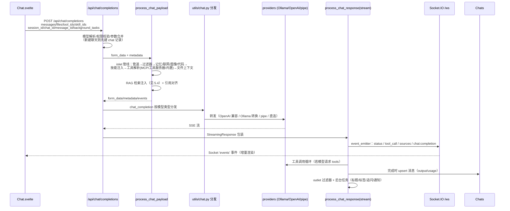
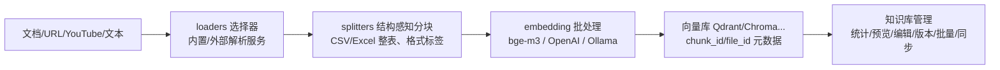
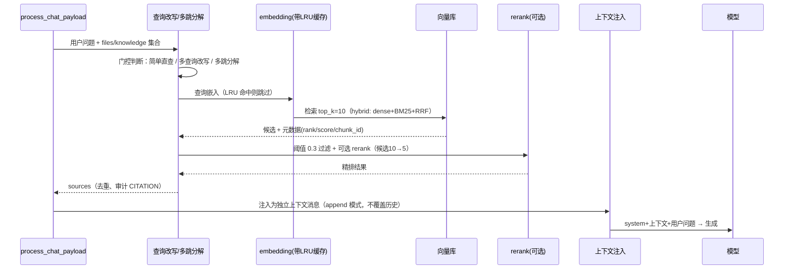
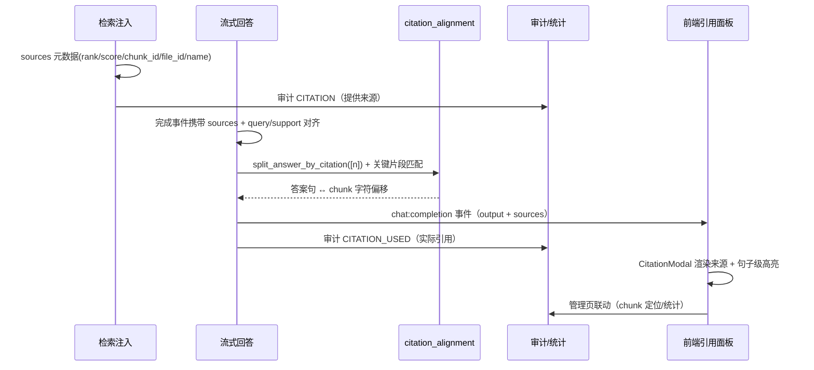
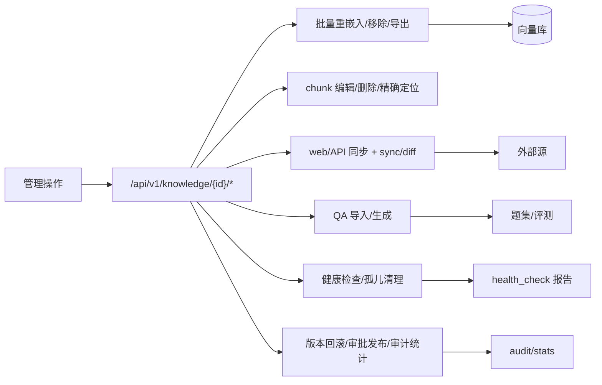

# Open WebUI 项目架构分析报告

> 分析对象：`D:\VScode\VScode_files\openwebui-dev\open-webui`（本地分支 `test/rag-validation`）
>
> 报告日期：2026-08-13

---

## 1. 项目概览

本项目是 **Open WebUI v0.10.2** 的深度定制分支。Open WebUI 本身是一个开源的自托管 AI 对话前端/网关，为 Ollama、OpenAI 兼容服务、Anthropic、Google Gemini 等模型后端提供统一的 Web 界面与 API 代理。本地副本在其上叠加了大量面向“企业 AI 知识库 + RAG（检索增强生成）”的改造，涉及约 **176 个文件、新增约 30.8k 行代码**（相对上游基线 `ecd48e2f7` / v0.10.2）。

### 1.1 技术栈

| 层次 | 技术 |
| --- | --- |
| 后端框架 | Python 3.11–3.12，FastAPI 0.136.3，Uvicorn，Pydantic 2.13 |
| 数据库 | SQLAlchemy 2.0（asyncio）+ Alembic 迁移；默认 SQLite（aiosqlite），可切换 PostgreSQL（psycopg）/MySQL |
| 向量数据库 | 默认 Chroma / Qdrant，另支持 Milvus、pgvector、Elasticsearch、OpenSearch、Pinecone、Weaviate 等十余种 |
| 实时通道 | python-socketio（Socket.IO）挂载于 `/ws`，用于流式事件、在线状态、协同编辑 |
| 缓存/任务 | Redis（可选）：会话共享、任务编排、WebSocket 跨实例消息 |
| 前端 | Svelte 5 + SvelteKit 2 + Vite 5 + Tailwind 4 + TypeScript；Socket.IO Client；Tiptap/ProseMirror（富文本）、CodeMirror、Pyodide（浏览器端 Python）、Mermaid/Vega（渲染）、i18next（国际化） |
| 模型接入 | openai、anthropic、google-genai SDK；Ollama 原生接口；OpenAI 兼容代理（含 Azure、Responses API）；Pipelines 管道 |
| RAG 能力 | LangChain（文档加载/切分）、sentence-transformers（本地 embedding/rerank，如 BAAI/bge-m3）、pypdf/docx2txt/python-pptx 等文档解析、数十种联网搜索源 |
| 评测/运维 | 独立 `eval/` 目录：评测脚本、题集、回归门禁、健康巡检、备份恢复、MCP 服务 |

### 1.2 定制改造主线（相对上游）

1. **检索质量**：独立 rerank、混合检索（Qdrant dense+BM25+RRF）、结构化感知分块、CSV/Excel 整表读取、格式来源标签、查询改写（A/B 后默认关闭）、多跳问题分解（默认开启）、查询嵌入 LRU 缓存。
2. **引用溯源**：检索元数据（rank/score/chunk_id/file_id）透传、`CITATION`（提供）与 `CITATION_USED`（实际使用）双层审计、答案句子与原文 chunk 的逐句对齐高亮、前端引用面板/管理页定位。
3. **知识库管理**：知识库统计、chunk 级预览/编辑/删除、批量重嵌入/移除/导出、文件版本历史与回滚、标签、web/API 同步、QA 导入与生成、健康检查与孤儿清理、发布审批流、目录（文件夹）管理。
4. **安全合规**：敏感内容过滤、检索审计日志、LDAP、OAuth、SCIM 2.0、API 密钥、细粒度访问授权（access grants）、模型访问控制。
5. **评测运营闭环**：68 题检索评测集 + 12 题多跳集 + 反馈回流题集（版本化 + SHA 钉定）、在线答案质量 LLM 评判、引用有效性评测、全量回归门禁、周度调度。
6. **运维**：`stackctl` 一键起停、`health_check` 健康自检、`backup_restore` 备份恢复、定时维护（每日 03:00）、pre-commit 门禁、依赖扫描。

---

## 2. 总体架构

### 2.1 分层架构图

### 2.2 设计思路要点

- **单进程单体、模块化分层**：FastAPI 同时服务 REST、WebSocket 与静态前端（生产构建后由后端托管），降低部署复杂度；内部按 `routers / models / utils / retrieval / socket / storage / tools` 清晰分层，便于横向扩展与二次开发。
- **“网关 + 代理”模型**：后端不持有模型，而是把所有主流模型接口统一为 OpenAI 兼容的 chat/completions 语义（含 Ollama 转换、Responses API 转换、Azure 地址改写），前端只需面向一套协议。
- **出站中间件管线**：聊天请求在真正发往模型前，会经过“管道 inlet → 过滤器 inlet → 记忆/联网/图像/代码解释器 → 工具解析 → 文件上下文 → RAG 注入”的统一管线；响应侧同样有 outlet/流式过滤器与工具调用循环。这是全项目最核心的扩展点。
- **可插拔基础设施**：向量库（`retrieval/vector/factory.py`）、文件存储（`storage/provider.py`）、OAuth（`utils/oauth.py`）、工具服务器（`utils/tools.py`）均采用抽象基类 + 工厂注册，运行时可切换。
- **事件驱动的前后端通信**：流式 token 通过 HTTP SSE 返回；而状态事件（检索中、工具调用、来源、任务进度、完成）通过 Socket.IO `events` 事件桥推送，避免 HTTP 长连接承载全部状态；同一通道同时负责 DB 增量持久化。
- **运行时配置优先于硬编码**：全局配置集中在 `config.py`（约 132KB 的 pydantic 设置），用户/管理员可改的配置存储在数据库 `Config` 表，启动时合并；特性开关（如 `ENABLE_RAG_RERANK`、`RAG_QUERY_DECOMPOSITION_ENABLE`）均可热更新。

---

## 3. 目录结构与模块分析

### 3.1 仓库根目录（open-webui/）

| 文件/目录 | 作用 |
| --- | --- |
| `pyproject.toml` | Python 包定义与全部依赖锁（hatchling 构建；`open-webui = "open_webui:app"` 为入口）；版本取自 `package.json` |
| `package.json` | 前端依赖与脚本（dev/build/check/lint/i18n）；版本 0.10.2 |
| `Dockerfile` / `docker-compose*.yaml` | 容器化部署（GPU、API、数据卷、Otel、Playwright 等场景） |
| `.env.example` / `.env` | 环境变量模板与本地实际配置（密钥类已改为环境变量注入） |
| `svelte.config.js` / `vite.config.ts` / `tailwind.config.js` / `tsconfig.json` | 前端构建配置（SvelteKit adapter-node，静态资源拷贝 pyodide/sql.js 等） |
| `backend/` | Python 后端（见 3.2） |
| `src/` | SvelteKit 前端源码（见 3.3） |
| `static/` | 静态资源（图标、主题、audio、pyodide、sql.js 等） |
| `eval/` | 评测运营体系（脚本/题集/结果/MCP 服务，见 3.4） |
| `scripts/` | 辅助脚本（如 `prepare-pyodide.js` 拉取浏览器端 Python 运行时） |
| `tests/` `test/` | Python / E2E 测试 |
| `docs/` | 官方文档（当前仅 SECURITY.md） |
| `.githooks/` | 本地 git hooks（pre-commit：py 编译 + 题集 SHA + 健康检查） |

### 3.2 后端 `backend/open_webui/`

#### 3.2.1 应用装配与生命周期

| 文件 | 作用与设计思路 |
| --- | --- |
| `main.py`（105KB） | FastAPI 应用工厂：中间件注册、27+ 路由挂载、`/api/chat/completions` 总入口（聊天元数据处理、频道权限门禁、新建聊天落库、标题生成任务）、`/api/chat/completed`、健康/就绪检查、静态前端托管。核心哲学：**把聊天编排留在主入口，路由只负责 HTTP 面**。 |
| `env.py`（47KB） | 环境变量集中读取：路径（DATA_DIR/STATIC_DIR）、数据库、Redis、WebSocket、代理超时、认证 cookie、RAG 参数等；同时解析 CHANGELOG 供前端展示。 |
| `config.py`（133KB） | pydantic 设置类：所有可调参数（含大量 `ENABLE_*`/`RAG_*` 定制开关）与环境变量绑定；`initialize_runtime_config()` 启动时将 DB 中的 `Config` 覆盖值合入运行时。 |
| `events.py`（50KB） | 事件定义（`EVENTS.*`）：登录、注册、聊天创建/删除、配置变更、知识库操作等；`publish_event()` 负责审计记录与 webhook 通知。 |
| `internal/db.py` | SQLAlchemy 异步引擎/会话工厂：SQLite（WAL、busy_timeout 等 pragma 调优）与 PostgreSQL/MySQL 连接串归一化、连接池参数、Alembic 迁移入口。 |
| `tasks.py` | 基于 Redis 的跨进程任务管理：创建/停止/列举任务、`redis_task_command_listener` 监听停止指令、任务心跳清理。 |
| `functions.py` | 用户自定义“函数”（pipeline/pipe/filter）的执行框架：把用户以 Python 编写的函数安全加载为模型提供方、过滤器或工具。 |
| `migrations/` | Alembic 版本迁移（`versions/*.py`），升级数据库结构。 |

#### 3.2.2 REST 路由层 `routers/`

每个 router 对应一组资源，统一挂载前缀：

| Router | 前缀 | 职责要点 |
| --- | --- | --- |
| `openai.py` | `/openai` | OpenAI 兼容代理：`/chat/completions`、`/responses`、`/embeddings`、`/models`、音频/图像、通用 `/{path:path}` 透传；含 Azure 地址/参数改写、Responses↔Chat 转换、SSE 流式包装、错误上报。 |
| `ollama.py` | `/ollama` | Ollama 原生代理（/api/chat、/api/generate、模型管理、拉取/删除），并把 Ollama 流式响应转换为 OpenAI 格式。 |
| `chats.py` | `/api/v1/chats` | 聊天 CRUD、搜索、导入导出、统计（usage/stats）、归档、分享、文件夹归类、标签。 |
| `auths.py` | `/api/v1/auths` | 登录/注册/登出、LDAP、OAuth 会话、API Key 管理、管理员配置。 |
| `users.py` | `/api/v1/users` | 用户管理（角色、状态、资料、权限、webhook）。 |
| `models.py` | `/api/v1/models` | 自定义模型（BaseModel 包装：系统提示、参数、知识库关联、技能、权限）。 |
| `knowledge.py`（131KB，含大量定制） | `/api/v1/knowledge` | 知识库全生命周期：创建/导入/重嵌入/统计/chunk 管理/批量操作/标签/外部连接/web+API 同步/QA/健康/审计/版本/审批/目录。 |
| `retrieval.py`（140KB） | `/api/v1/retrieval` | 检索核心：embedding 配置、文档处理（file/text/web/youtube/batch）、`query/doc`、`query/collection`（含混合检索分支）、删除、重置。 |
| `files.py` | `/api/v1/files` | 文件上传/下载/内容提取/版本历史（定制）/批量操作/去重。 |
| `tools.py` / `skills.py` / `functions.py` / `pipelines.py` | 对应工作台资源 | 工具 CRUD + 工具服务器（OpenAPI/MCP）；技能（Skills）；函数（pipe/filter）；Pipelines 管理。 |
| `prompts.py` / `memories.py` / `notes.py` / `channels.py` / `groups.py` / `folders.py` / `automations.py` / `calendar.py` | 各资源域 | 提示词、长期记忆、富文本笔记（Yjs 协同）、频道/群组消息、目录、自动化任务、日历。 |
| `images.py` / `audio.py` / `terminals.py` | 多模态与终端 | 图像生成（AUTOMATIC1111/OpenAI/内置 diffusers）、TTS/STT（faster-whisper）、Web 终端（xterm + 终端服务器）。 |
| `tasks.py` | `/api/v1/tasks` | 标题/标签/表情/追问/查询改写/多跳分解（`/queries/decompose`，定制）/反思循环（`/queries/reflect`，定制）/自动补全/MoA 等“任务模型”端点。 |
| `configs.py` / `analytics.py` / `evaluations.py` / `utils.py` / `scim.py` | 系统域 | 全局配置、用量分析、评测、通用工具（代码格式化/PDF/数据库下载）、SCIM 2.0 身份供应。 |

#### 3.2.3 数据模型层 `models/`

基于 SQLAlchemy `Base`（`internal/db.py`）声明式模型 + 手写异步 `*Table` 类（如 `UsersTable`、`Chats`、`Messages`、`Config`、`Knowledge`、`AccessGrants`）。主要实体：

- 身份与访问：`User`、`ApiKey`、`OAuthSession`、`AccessGrants`（资源级授权）、`Group`（用户组/角色）；
- 会话数据：`Chat`（含 history JSON 与 messages 数组）、`ChatMessage`/`Messages`（频道消息）、`SharedChat`、`Feedback`（点赞/点踩）、`Tags`、`PromptHistory`；
- 工作台资源：`Model`（自定义模型）、`Knowledge`（知识库）、`File`、`Prompt`、`Tool`、`Skill`、`Function`、`Folder`、`Memory`、`Note`、`Automation`、`CalendarEvent`；
- 系统：`Config`（键值运行时配置，支持前缀命名空间）、`AuditLog`（审计）。

设计思路：`Config` 用 JSON 键值存储用户可配置项，避免大量迁移；`Chat` 主体存 JSON blob（灵活、快），并配轻量索引列（folder_id、pinned、archived 等）支撑列表查询。

#### 3.2.4 业务逻辑与工具层 `utils/`

| 文件 | 作用与设计思路 |
| --- | --- |
| `middleware.py`（262KB，**核心**） | 出站处理管线：`process_chat_payload()`（inlet：管道/过滤器/记忆/联网/图像/代码解释器/工具解析/技能/RAG 注入/引用对齐）与 `process_chat_response()`（流式/非流式响应处理、工具调用循环、最终落库、outlet 过滤器、后台任务）。 |
| `chat.py` | 聊天路由分发：按模型类型（pipe 函数 / Ollama / OpenAI 兼容 / 直连模型）选择后端，负责 OpenAI↔Ollama 载荷转换。 |
| `tools.py`（62KB） | 工具体系：内置工具注册、工具服务器（OpenAPI spec → 可调用函数）、MCP 客户端接入、终端工具、`process_tool_result`（含文件/嵌入/引用解析）。 |
| `models.py` | 模型列表聚合（`get_all_models`：合并 Ollama + OpenAI 兼容 + 自定义模型 + 管道模型）、访问控制检查。 |
| `auth.py` / `oauth.py` | JWT 签发校验、API Key、会话；OAuth（Google/GitHub/Entra/Azure AD 等）回调与 token 交换。 |
| `audit.py` / `logger.py` | 审计日志（`AUDIT_LOG_LEVEL` 门控、排除路径）、日志格式化与轮转。 |
| `asgi_middleware.py` | 纯 ASGI 中间件（AuthToken、SecurityHeaders、CommitSession、WebsocketUpgradeGuard、Redirect），替代 BaseHTTPMiddleware 以规避客户端断连时的 CancelledError 风暴（代码注释中明确说明）。 |
| `context_compaction.py` | 长对话上下文压缩：token 阈值触发摘要注入。 |
| `payload.py` / `response.py` / `filter.py` | OpenAI/Ollama 载荷转换、响应格式转换、过滤器（自定义函数）执行。 |
| `code_interpreter.py` / `session_pool.py` | Pyodide/Jupyter 代码执行与会话池管理。 |
| `memory.py` / `task.py` | 长期记忆存取与“任务模型”调用（标题/标签/查询等）。 |
| `citation_alignment.py`（定制） | 纯函数：答案按 `[n]` 拆分、答案句关键片段与 chunk 原文做字符偏移对齐，供前端高亮。 |
| `query_rewrite.py`（定制） | 查询改写（多查询生成）与 LRU 缓存；A/B 后默认关闭。 |
| `content_safety.py`（定制） | 正则扫描敏感内容（high/medium）、脱敏与密钥发现。 |
| `redis.py` / `rate_limit.py` / `webhook.py` / `plugin.py` / `sanitize.py` / `headers.py` 等 | 基础设施小工具。 |

#### 3.2.5 检索域 `retrieval/`

- `loaders/`：文档加载器（main.py 汇总；Markdown/PDF/CSV/Excel/HTML 等 + 定制“整表读取”与格式标签；外部服务 loader：MinerU、Mistral、Tavily、PaddleOCR-VL、YouTube 等）。
- `splitters.py`：分块策略（character/token/token_transformers/**structure**——结构感知分块，表格/代码块保持完整）。
- `vector/`：`factory.py` 按 `VECTOR_DB` 选择实现；`dbs/` 下十余种向量库客户端；定制 `qdrant_hybrid.py`（dense+BM25+RRF 原生混合）与 `qdrant_multitenancy.py`（租户隔离 + chunk/file 过滤）。
- `web/`：30+ 搜索源（DuckDuckGo、Brave、Bing、SearXNG、Tavily、Perplexity、Firecrawl 等）。
- `models/`：reranker 抽象（bge-reranker、ColBERT、外部 API）。
- `utils.py`（核心）：`query_collection`（纯向量）、`query_collection_with_hybrid_search`（混合 + rerank + 阈值过滤）、embedding 批处理/并发信号量/**查询嵌入 LRU 缓存**（定制）、rerank 管线、结果合并去重、元数据与 debug 透传。

#### 3.2.6 实时层 `socket/main.py` 与存储/工具

- `socket/main.py`：Socket.IO 服务器。事件包括 `connect`（JWT/API Key 鉴权）、`user-join`（加入 `user:{id}` 房间）、`heartbeat`、`usage`（token 用量池）、`join-channels`/`events:channel`、`events:chat`、`ydoc:*`（Yjs 协同文档状态/更新/awareness，用于笔记实时协作）；`get_event_emitter()` 把后端事件转成 socket 广播并增量写 DB。
- `storage/provider.py`：文件存储抽象（Local/S3/GCS/Azure）。
- `tools/builtin.py`（142KB）：内置原生工具（联网搜索、抓取 URL、生成/编辑图像、执行代码、记忆增删查、笔记、聊天搜索、知识库查询、频道消息等）。
- `tools/knowledge_fs.py`：把知识库按“文件系统”路径暴露给工具（list/read/grep）。

### 3.3 前端 `src/`

| 目录 | 作用 |
| --- | --- |
| `routes/` | SvelteKit 路由：`(app)` 组（`+page` 主入口、`c/[id]` 聊天页、`home`、`workspace/*`（模型/知识库/提示词/工具/技能/函数）、`admin/*`（设置/用户/函数/评测/分析）、`channels`、`notes`、`playground`、`automations`、`calendar`）；`auth` 登录页；`s/[id]` 分享页；`watch` 监控页。 |
| `lib/apis/` | 按域拆分的 API 客户端（auths/chats/knowledge/retrieval/openai/ollama/tasks/…），封装 fetch + token 注入；`openai/index.ts` 的 `generateOpenAIChatCompletion` 即聊天主请求（POST `/api/chat/completions`）。 |
| `lib/stores/` | 全局 Svelte stores：user/config/socket/chatId/chatTitle/channels/models/settings/theme/usage 等，跨组件共享状态。 |
| `lib/components/` | UI 组件树：`chat/`（Chat.svelte 96KB 主会话组件、MessageInput、Messages、Message、ResponseMessage、Citations/CitationModal 引用面板、ChatControls、XTerminal 等）；`layout/`、`admin/`、`workspace/`、`common/`、`icons/` 等。定制组件 `workspace/Knowledge/KnowledgeBase/ManagementPage.svelte`（知识库管理页）。 |
| `lib/utils/` | 通用工具（index.ts 63KB：渲染、文件、Markdown、流式解析、prompt 变量等）。 |
| `lib/constants/`、`lib/i18n/`、`lib/types/`、`lib/workers/`、`lib/pyodide/` | 常量（API 路径/名称）、i18next 多语言、TS 类型、Web Worker（TTS/STT 等）、Pyodide 运行时加载。 |

### 3.4 评测与运维 `eval/`

| 子目录 | 内容 |
| --- | --- |
| `scripts/`（40+） | 检索评测（run_retrieval_eval）、答案评测（run_rag_answer_eval）、引用评测（run_citation_eval）、多跳（run_multihop_eval）、无答案（run_noanswer_eval）、在线质量（run_online_quality_eval）、回归门禁（run_regression_gate）、参数网格、A/B、embedding/限速/内容安全/权限测试；运维：stackctl、health_check、backup_restore、scheduled_maintenance、依赖扫描、MCP 服务配置等。 |
| `datasets/` | 题集（retrieval_questions*.jsonl 68 题、multihop_questions.jsonl 12 题、feedback_questions*.jsonl 反馈回流，均含版本与 SHA 记录）。 |
| `tests/` | 与评测配套的脚本级测试（引用、批量、版本、去重、权限等）。 |
| `results/` `logs/` `backups/` | 评测结果、运行日志、备份。 |
| `kb_samples/` `kb_src/` | 知识库样例与原始文档（31 份开源 AI 项目官方文档等）。 |
| `mcp_server/` | 定制 MCP 服务端（kb_search 等，入站 Bearer 鉴权 + /health）。 |

---

## 4. 各组件的作用与设计思路

### 4.1 应用入口与生命周期（main.py + events.py）

**作用**：组装应用、注册中间件/路由、管理启动与关闭流程。

**设计思路**：
- 使用 FastAPI `lifespan` 上下文而非旧式 `on_event`：启动顺序固定为“日志 → 重置/迁移配置 → 种子默认值 → 初始化运行时配置 → 建管理员 → 安装函数/工具依赖 → 启动 Redis 监听 → 线程池限制 → 后台清理任务 → 自动化调度器 → 预热模型与工具服务器 → 置 `startup_complete=True`”。
- `app.state` 承载运行时单例（MODELS、EMBEDDING_FUNCTION、RERANKING_FUNCTION、redis、TOOL_SERVERS 等），供各路由共享。
- 提供独立就绪检查端点，在 `startup_complete` 前拒绝流量，避免首请求触发昂贵的冷启动竞态。
- 事件系统统一收口“发生了什么”（登录、聊天、配置变更），审计与 webhook 从事件系统派生，业务代码不直接写审计日志。

### 4.2 中间件链（asgi_middleware.py + main.py）

**作用**：统一处理认证令牌、安全头、会话提交、WebSocket 升级守卫、CORS、压缩、审计。

**设计思路**：刻意使用纯 ASGI 中间件实现（`RedirectMiddleware`、`SecurityHeadersMiddleware`、`CommitSessionMiddleware`、`AuthTokenMiddleware`、`WebsocketUpgradeGuardMiddleware`），替代 `BaseHTTPMiddleware`/`@app.middleware('http')`。原因在代码注释中写明：旧实现会把下游请求包进 anyio 任务组，客户端断连/响应完成时取消在途数据库调用，产生 `terminate_force_close` 噪音与 CancelledError 风暴。纯 ASGI 让请求生命周期可控。

### 4.3 聊天编排（utils/middleware.py + utils/chat.py + routers/openai.py）

这是全项目最重要的组件，详见第 5 章数据流。设计要点：

- **双入口**：`/api/chat/completions`（主入口，含完整元数据/权限/落库/任务编排）与 `/openai/chat/completions`（纯 OpenAI 兼容代理）。前端走前者；外部 OpenAI 客户端走后者（也可触发 RAG，但少了 UI 语义字段）。
- **载荷统一**：所有模型后端统一成 OpenAI chat/completions 语义；Ollama 在 `utils/payload.py` 转换，Responses API 在 `routers/openai.py` 转换，直连模型（`direct: true`）走 WebSocket 事件调用。
- **流式与状态分离**：SSE 返回 token 流；状态事件（status/工具调用/来源/完成）走 Socket.IO。流式响应处理函数把 token 流解析为结构化的 `output` 数组（message/reasoning/function_call/function_call_output/code_interpreter 等 OR-aligned items），这是 Svelte 前端渲染多模态消息的契约。

### 4.4 模型与访问控制（models/ + utils/models.py + AccessGrants）

**作用**：聚合模型目录、包装自定义模型、执行细粒度访问控制。

**设计思路**：
- 模型目录 = 基础模型（Ollama/OpenAI 连接）+ 自定义模型（`Model` 记录，可设 base_model_id、params、knowledge、skills、capabilities、filter_ids）+ 管道模型（pipe）+ 竞技场模型（arena，多子模型随机/轮询）。
- `get_all_models()` 从各连接拉取并缓存在 `app.state.MODELS`/`OPENAI_MODELS`，带 urlIdx 以便代理路由。
- 访问控制三层：模型级（`check_model_access`，角色/组）、资源级（`AccessGrants`：user/knowledge/channel/folder 等）、操作级（`has_permission` 功能开关）。

### 4.5 工具系统（utils/tools.py + tools/builtin.py + MCP）

**作用**：把“能力”暴露为模型可调用的 function calling 工具。

**设计思路**：
- 三层来源：**内置工具**（builtin.py，仅 UI 会话默认注入）、**用户工具**（工具服务器 OpenAPI spec / Python 自定义工具）、**MCP 服务器**（`server:mcp:` 前缀，动态连接并包装为工具函数）。
- 两种函数调用模式：**native FC**（把 tools 直接放进请求体，模型原生 tool_calls，后端循环执行）与 **legacy FC**（旧版：先用工具提示词让模型输出，再解析执行），由 `params.function_calling` 开关切换；UI 默认 native。
- 工具结果统一经 `process_tool_result` 后处理：文件/图片数据 URI、嵌入、引用来源提取，再拼装为 `function_call_output`。

### 4.6 RAG 检索域（retrieval/）

**作用**：文档入库（加载→切分→嵌入→向量存储）与在线检索（查询嵌入→召回→重排→注入）。

**设计思路**（含定制）：
- 加载器按文件类型/来源动态选择（本地解析与外部解析服务并存，外部不可达时回退内置 loader）；CSV/Excel 采用“整表读取”避免表格被拆碎。
- 分块默认 `structure`：保留表格、代码块完整性，中文按句边界切分；块携带来源标签与格式标签，避免与原文重复干扰。
- 向量库抽象统一接口（`VectorDBBase`），Qdrant 支持原生混合检索（dense + BM25 + RRF）与多租户隔离。
- 查询侧默认路径：纯向量 `query_collection`（top_k=5，阈值 0.3，经 A/B 与性能实测锁定）；可选 rerank（候选 10 → 精排 5）与混合检索。
- 查询嵌入做 **LRU 缓存**（键含形状隔离），重复查询延迟从 185ms 降至 58ms。
- 多跳分解：LLM 门控判断复杂问题 → 拆分子查询 → 分别检索 → 合并去重（默认开启，多跳集 hit@5 从 0.667 提到 0.917）。

### 4.7 引用溯源（utils/citation_alignment.py + 审计钩子 + 前端 Citations 组件）

**作用**：让“模型引用了哪个 chunk”可核对、可审计、可可视化。

**设计思路**：
- 检索结果携带 `rank/score/chunk_id/file_id/name` 元数据，注入前在 `metadata.sources` 留存；
- 聊天开始时记 `CITATION`（“提供了哪些来源”），回答完成后从最终 output 提取文本再记 `CITATION_USED`（“实际用了哪些”），并做一致性校验；
- `citation_alignment.py` 纯函数把答案按 `[n]` 切句，抽取句内关键词（英文 ≥3 字符、中文 4-gram）与 chunk 原文匹配，输出字符偏移；前端 CitationModal 据此做句子级高亮；
- 审计钩子（`_audit_citation_sources`/`_audit_citation_usage`）同时写入审计日志与知识库 `/audit/stats`。

### 4.8 实时通道（socket/main.py）

**作用**：连接保持、房间管理、事件广播、协同编辑、在线状态。

**设计思路**：
- 连接时用 JWT/API Key 鉴权，加入 `user:{id}` 房间；事件按房间广播，天然支持多标签页与多实例（Redis adapter 可选）。
- `get_event_emitter(metadata)` 根据 chat_id 前缀分流：普通聊天 → 广播 `events` 事件 + 增量写 DB；频道聊天 → 节流（0.15s）写频道消息表并广播 `events:channel`。
- `usage` 事件维护活跃 token 用量池，供管理页实时监控。
- Yjs/CRDT（`ydoc:*`）支撑笔记等文档的多人实时协同编辑。

### 4.9 前端（src/）

**作用**：聊天/工作台/管理界面 + 状态管理 + API 客户端。

**设计思路**：
- **Chat.svelte 为主会话编排器**：管理消息历史（`_history`）、临时聊天（`local:{socketId}`）、多模型并发响应（message_ids）、重生成/继续、文件与工具选择、Socket 事件分发（`chat:completion` 增量渲染 output）。
- **MessageInput.svelte**：富文本/斜杠命令/技能/工具选择/录音/附件；发送时把“会话上下文”打包进一次请求（messages、files、tool_ids、skill_ids、terminal_id、features、session_id、chat_id、message_id、background_tasks…）。
- **组件即协议**：`ResponseMessage` 渲染结构化 output（reasoning/function_call/code_interpreter）；`Citations.svelte`/`CitationModal.svelte` 渲染引用来源与高亮。
- **单一 API 门面**：所有 fetch 封装 token、错误归一化；聊天流式响应由 `streaming/` 客户端逐事件解析。

### 4.10 评测与运维体系（eval/）

**作用**：把“RAG 好不好、引用真不真、权限牢不牢”变成可量化、可回归、可调度的问题。

**设计思路**：
- 题集版本化 + SHA 钉定，回归门禁锁定质量基线（68 题：hit@1=0.788、hit@5=1.0；引用 valid=1.0、hallucination=0）。
- 评估脚本与产品代码解耦（独立 `eval/` 目录），但通过 HTTP 驱动真实链路（含 UI E2E），避免“单元测试通过、线上不工作”。
- 运维工具（stackctl/health_check/backup_restore/scheduled_maintenance）覆盖“一键起停 → 健康自检 → 定时巡检 → 备份恢复”的日常闭环。

---

## 5. 运行时关键数据流转

### 5.1 应用启动生命周期

**要点**：DB 中的 `Config` 覆盖是运行时配置的核心机制——管理员在界面修改的设置写入 DB，下次启动（或配置热更新接口）合入 `app.state`；所有模型/工具服务的预热避免首个用户请求“背锅”冷启动。

### 5.2 认证与会话

**要点**：同一套 JWT 兼容浏览器会话、API 客户端与 WebSocket（socket connect 时用 token 鉴权）；另有 `ApiKey`（生成式、可撤销）供脚本使用；OAuth（utils/oauth.py，多提供商 + Azure AD/Entra）、LDAP、SCIM 均汇入同一 `User` 模型。

### 5.3 聊天主链路（最核心的运行时数据流）

**阶段详解**：

1. **请求进入**：前端把整个“会话快照”提交（临时聊天才带全量 messages；持久聊天后端按 chat_id + user_message_id 从 DB 重建消息，保证结构化 output 不丢失）。
2. **元数据处理**（main.py）：模型解析（自定义模型 base_model_id 回退、直连模型标记）、`parent_id` 语义（null=新聊天）、多模型 `message_ids`、频道权限门禁、新聊天落库、初始标题后台生成。
3. **inlet 管线**（process_chat_payload）：
   - 竞技场模型先随机解析子模型；`apply_params_to_form_data` 合并模型参数；
   - DB 重建消息 → 上下文压缩（超阈值摘要）→ 消息清洗（合并 system、去空块）；
   - 特性处理：语音提示模板、记忆上下文、联网搜索、图像生成、代码解释器（native FC 时改为注入内置工具而非提示词）；
   - 技能：`<skill>` 全文注入（被提及/无内置工具）或 `<available_skills>` 清单 + `view_skill` 工具按需读取；
   - 工具：MCP 动态连接、用户工具、内置工具（UI 会话默认注入）、终端工具；
   - 文件：`add_file_context` 注入附件上下文；
   - **RAG 注入**（见 5.4）与引用元数据（sources/rag_source_id_map）准备。
4. **模型调用**：`utils/chat.py` 按 `model.owned_by`/`pipe`/直连分发；`routers/openai.py` 负责连接选择、Azure/Responses 转换、SSE 检测与 `stream_wrapper`。
5. **响应处理**（process_chat_response → streaming_chat_response_handler）：
   - 解析流式 delta 为结构化 output（reasoning、message、function_call 等）；
   - 检测到 tool_calls 进入工具循环：解析参数 → 查找工具（server-side 直接调用 / direct 工具经 event_caller 走前端）→ `process_tool_result`（文件/嵌入/引用）→ 追加 function_call_output → 再次请求模型，直到无工具调用或达最大迭代；
   - 完成时：`done=True` 事件、落库（`Chats.upsert_message_to_chat_by_id_and_message_id`）、用户 webhook 通知（离线时）、引用使用审计、outlet 过滤器、后台任务（标题/标签/追问）。

### 5.4 RAG 检索与知识库查询

**入库链路**：

**查询链路**（聊天中触发，`query_collection` / `query_collection_with_hybrid_search`）：

**要点**：
- 上下文以“追加消息”注入（`RAG_APPEND_CONTEXT=true`）而非改写用户历史，保证可追溯、可清理；
- 注入前记录 `metadata.sources` 与 `rag_source_id_map`，模型回答 `[n]` 编号即对应这些来源；
- 多跳分解默认开启：LLM 判断复杂度后生成子查询，合并检索结果再去重；
- 检索权限：`_validate_collection_access` 按 AccessGrants 校验集合读权限；检索审计 `_audit_retrieval` 记录查询（无原文）。

### 5.5 引用溯源数据流

### 5.6 Socket.IO 事件桥与状态持久化

- 前端连接 `/ws`，`connect` 鉴权后 `user-join` 加入 `user:{user_id}` 房间；
- 聊天请求带 `session_id`（socket id），后端 `get_event_emitter()` 返回闭包：
  - 普通聊天：`sio.emit('events', {chat_id, message_id, data})` 到 `user:{id}` 房间；同时按事件类型增量写 DB（status→status 数组、message→content 追加、source/citation→sources 数组、files→files 数组）；
  - 频道聊天：`_make_channel_emitter` 节流更新频道消息表并广播 `events:channel`；
- `get_event_call()` 提供反向通道：direct 工具执行、Pyodide 代码解释器等“需要浏览器配合”的操作由后端发 `execute:tool` 事件，前端执行后回传结果。

### 5.7 后台任务与自动化

- **标题/标签/追问**：`background_tasks` 字段控制，由 `background_tasks_handler(ctx)` 在回答完成后串行执行；标题生成使用任务模型（`task.model.default/external` 可独立配置，避免占用主模型）；
- **自动化（automations）**：`scheduler_worker_loop` 后台循环扫描到期任务（如定时向模型提问、生成周报），复用聊天链路，支持 webhook 通知；
- **Redis 任务**：长任务（如批量重嵌入、知识库同步）注册到 Redis，支持跨进程停止（`redis_task_command_listener`）、状态查询、超时清理；
- **周期维护**：`periodic_usage_pool_cleanup`（用量池）、`periodic_session_pool_cleanup`（会话池）、`scheduled_maintenance.py`（每日健康巡检 + 孤儿清理 + 备份）。

### 5.8 知识库管理端到端（定制）

管理员/授权用户在 `ManagementPage.svelte`（或 API）执行：

---

## 6. 定制改造与特性开关清单（要点）

| 领域 | 开关/入口 | 默认 | 说明 |
| --- | --- | --- | --- |
| 检索 | `RAG_TOP_K` / `RAG_TOP_K_RERANKER` | 5 / 10 | 最终注入条数 / rerank 候选池 |
| 检索 | `RAG_RELEVANCE_THRESHOLD` | 0.3 | rerank 得分过滤阈值 |
| 检索 | `ENABLE_RAG_RERANK` | true | 独立 rerank；评测后定稿 |
| 检索 | `ENABLE_RAG_HYBRID_SEARCH` | false | Qdrant 原生 dense+BM25+RRF |
| 检索 | `RAG_TEXT_SPLITTER` | structure | 结构感知分块 |
| 检索 | `RAG_FULL_CONTEXT_MAX_CHARS` / `_STRATEGY` | 20000 / head_tail | full-context 注入上限与策略 |
| 检索 | `RAG_APPEND_CONTEXT` | true | 上下文以追加消息注入 |
| 检索 | `RAG_QUERY_REWRITE_CACHE` / `_TTL` | true / 300s | 查询改写缓存（改写本体 A/B 后关闭） |
| 检索 | `RAG_QUERY_DECOMPOSITION_ENABLE` / `_MAX_QUERIES` | true / 3 | 多跳问题分解（`POST /tasks/queries/decompose`） |
| 检索 | `RAG_EMBEDDING_CACHE_SIZE` | 1024 | 查询嵌入 LRU 缓存 |
| 模型 | `RAG_EMBEDDING_MODEL_AUTO_UPDATE` / `RAG_RERANKING_MODEL_AUTO_UPDATE` | false | 锁定本地模型 revision（bge-m3） |
| 模型 | `CHAT_MODEL` / `CHAT_MODEL_SELECTOR_VISIBLE` | 空 / false | 锁定对话模型、隐藏选择器 |
| 安全 | `SENSITIVE_CONTENT_FILTER` | true | 上传/记忆写入拦截 high 敏感内容 |
| 安全 | `ENABLE_RETRIEVAL_AUDIT` | true | 检索审计（audit.log，无原文） |
| 合规 | `ENABLE_AUDIT_LOGS_FILE` | 独立控制 | 修复审计 sink 被 `AUDIT_LOG_LEVEL` 门控的问题 |
| 环境 | `QDRANT_URI` | `http://127.0.0.1:6333` | 避开 localhost IPv6(::1) 回退导致的每次 +2s 延迟 |
| 环境 | `HF_ENDPOINT` / `HF_HUB_CACHE` | hf-mirror / 工作区缓存 | 国内镜像与模型缓存 |
| 编排 | `ENABLE_REALTIME_CHAT_SAVE` | false | 实时保存聊天（默认完成时一次落库） |
| 编排 | `ENABLE_WEBSOCKET_SUPPORT` / `WEBSOCKET_MANAGER` | true / 空 | 是否启用 Socket.IO 与 Redis 广播模式 |
| 门禁 | `ENABLE_RETRIEVAL_QUERY_GENERATION` | false | 查询改写总开关（DB `task.query.retrieval.enable`） |

**新增/深度改造的核心文件**：

- 后端：`config.py`、`routers/knowledge.py`（+1618 行）、`routers/retrieval.py`、`routers/files.py`（版本/批量）、`routers/tasks.py`（`/queries/decompose`、`/queries/reflect`）、`utils/middleware.py`（引用审计钩子/注入稳定性/对齐）、`utils/citation_alignment.py`、`utils/query_rewrite.py`、`utils/content_safety.py`、`retrieval/utils.py`（rerank/缓存/元数据）、`retrieval/loaders/main.py`、`retrieval/splitters.py`、`retrieval/vector/dbs/qdrant_hybrid.py`、`qdrant_multitenancy.py`、`tools/builtin.py`（kb 系列工具）、`tools/knowledge_fs.py`。
- 前端：`src/lib/components/workspace/Knowledge/KnowledgeBase/ManagementPage.svelte`、`src/lib/components/chat/Citations.svelte`、`CitationModal.svelte`、`src/lib/apis/knowledge/index.ts` 等。
- 评测运维：`eval/`（scripts/datasets/tests/results/mcp_server）、`.githooks/pre-commit`、`.env.example`。

---

## 7. 关键文件索引

| 关注点 | 入口文件 |
| --- | --- |
| 应用装配/路由/生命周期 | `backend/open_webui/main.py` |
| 环境变量 | `backend/open_webui/env.py`、`.env.example` |
| 全局配置与开关 | `backend/open_webui/config.py` |
| 事件与 Webhook | `backend/open_webui/events.py` |
| 数据库引擎/迁移 | `backend/open_webui/internal/db.py`、`migrations/` |
| 认证/授权 | `routers/auths.py`、`utils/auth.py`、`utils/oauth.py`、`models/access_grants.py` |
| 聊天主链路 | `main.py`（`/api/chat/completions`）→ `utils/chat.py` → `utils/middleware.py` |
| 模型代理 | `routers/openai.py`、`routers/ollama.py`、`utils/payload.py`、`utils/response.py` |
| 工具系统 | `utils/tools.py`、`tools/builtin.py`、`utils/middleware.py`（工具循环） |
| RAG 检索 | `routers/retrieval.py`、`retrieval/utils.py`、`retrieval/vector/` |
| 知识库管理 | `routers/knowledge.py`、前端 `ManagementPage.svelte` |
| 引用溯源 | `utils/citation_alignment.py`、`utils/middleware.py`、前端 `Citations.svelte` |
| 实时通道 | `socket/main.py`、`src/lib/apis/streaming/` |
| 任务/自动化 | `tasks.py`、`routers/tasks.py`、`utils/automations.py` |
| 前端主组件 | `src/lib/components/chat/Chat.svelte`、`MessageInput.svelte` |
| 前端 API 门面 | `src/lib/apis/**/index.ts` |
| 评测与运维 | `eval/scripts/*`（run_regression_gate、stackctl、health_check、backup_restore 等） |
| 定制改造档案 | 工作区 `vibecoding_files/*.md`（差距分析、改造汇总、开关清单、评测报告） |

---

## 8. 总结

本项目在标准 Open WebUI 的“FastAPI 网关 + SvelteKit 前端 + 可插拔向量/模型后端”骨架上，成长为一套**带评测闭环的企业级 RAG 问答平台**：

- **架构上**：单体部署、分层清晰、中间件/管线/工厂三种扩展点并存，改动可控、可迁移（上游升级采用 diff 基线法）；
- **数据流上**：HTTP 承载请求与 token 流，Socket.IO 承载状态事件，SQL 承载业务数据，向量库承载语义检索，Redis 承载跨进程任务——职责边界分明；
- **工程化上**：题集版本化 + SHA 门禁 + 全量回归 + 定时巡检 + 备份恢复，把“AI 应用的质量”从感觉变成指标；
- **风险点上**：本地部署的模型锁定与国内镜像、`127.0.0.1` 延迟修复、敏感内容过滤与审计，均针对真实生产环境做了收敛。

如需深入某个子模块（如工具调用循环细节、评测门禁实现、MCP 服务、前端 output 渲染协议），可以基于本文索引继续展开。

---

*本文档由对 `open-webui` 仓库的静态分析生成；行号与统计以分析当日代码为准。*
